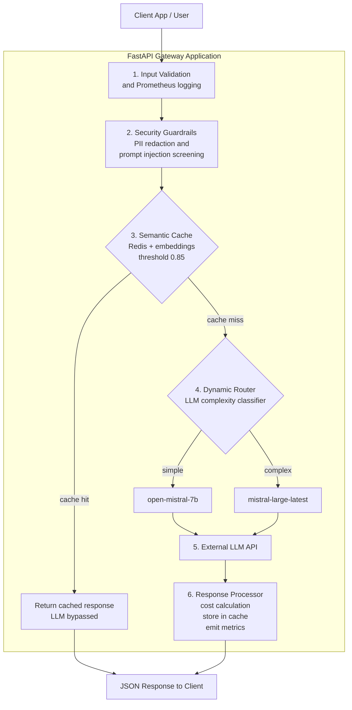

# LLM Gateway


> A production-grade API middleware that sits between your application and your LLM
> provider — routing by complexity, answering duplicates instantly from a semantic
> cache, and scrubbing PII before anything leaves your perimeter.

<div align="center">
  
</div>

## Overview

The **LLM Gateway** is a high-throughput, production-grade API middleware designed
to sit between client applications and Large Language Model providers.

As enterprises scale AI adoption, they run into three critical bottlenecks:
exorbitant API costs, latency ceilings, and security vulnerabilities (PII leaks
and prompt injections). This gateway addresses all three behind a single,
OpenAI-compatible API interface that handles dynamic model routing, semantic
caching, real-time safety guardrails, and full observability.

Everything runs locally in Docker Compose: one command starts the gateway,
the Redis cache, Prometheus, and Grafana.

## The Problem

| Bottleneck | Without a gateway | With this gateway |
| --- | --- | --- |
| API cost | Every request pays full price for the most capable model | Prompts are classified by complexity and simple ones go to cheap models; duplicates are served from cache for free |
| Latency | A repeated question still waits on a full LLM round trip | A cache hit (cosine similarity above 0.85) returns instantly, bypassing the LLM entirely |
| Security | Raw user input — SSNs, emails, injection payloads — flows straight to a third-party API | PII is redacted and prompt injections are blocked before anything leaves the perimeter |

The goal is not to hide the LLM behind magic — it is to make every call cheaper,
faster, and safer by default, while keeping the interface identical to the
OpenAI API your application already speaks.

## Key Features

| Feature | What it does |
| --- | --- |
| Dynamic model routing | Classifies prompt complexity and routes simple queries to cheap, fast models (`open-mistral-7b`), reserving expensive models (`mistral-large-latest`) for complex reasoning tasks |
| Semantic caching | Uses Redis and vector embeddings to cache responses. If a similar prompt (cosine similarity above 0.85) arrives, the gateway returns the cached response instantly, bypassing the LLM entirely |
| Security guardrails | Intercepts prompts to redact personally identifiable information using regex, and blocks adversarial prompt injection attacks before they reach external servers |
| Observability | Tracks token usage, cost, cache hits, and latency per request in real time with Prometheus, visualized in a live Grafana dashboard |

## Quick Start

After completing [Setup and Installation](#setup-and-installation):

```bash
docker-compose up -d --build
curl -X POST http://localhost:8000/v1/chat/completions \
  -H "Content-Type: application/json" \
  -d '{"model": "auto-router", "messages": [{"role": "user", "content": "What is the capital of France?"}]}'
```

## Table of Contents

- [Overview](#overview)
- [The Problem](#the-problem)
- [Key Features](#key-features)
- [Benchmark Results](#benchmark-results)
- [How It Works: The Request Lifecycle](#how-it-works-the-request-lifecycle)
- [Architecture](#architecture)
- [Observability](#observability)
- [Tech Stack](#tech-stack)
- [Project Structure](#project-structure)
- [Setup and Installation](#setup-and-installation)
- [Usage](#usage)
- [Command Reference](#command-reference)
- [Accessing the UIs](#accessing-the-uis)
- [Engineering Challenges and Solutions](#engineering-challenges-and-solutions)
- [Limitations and Scope](#limitations-and-scope)
- [Roadmap](#roadmap)
- [Contributing](#contributing)
- [License](#license)

## Benchmark Results

Tested against 50 varied and semantically duplicated requests — simulating
real-world chatbot traffic, where users ask the same questions in different
words:

```text
========================================
  ENTERPRISE BENCHMARK RESULTS
========================================
Total Requests      : 50
Cache Hits          : 47
Cache Misses        : 3
Cache Hit Rate      : 94.00%
Avg Latency/Request : 954.95ms
----------------------------------------
Cost WITHOUT Gateway (GPT-4o): $0.2463
Cost WITH Gateway (Mistral+Cache): $0.0002
Total Money Saved   : $0.2460 (99.90% reduction)
========================================
```

| Metric | Value |
| --- | --- |
| Cache hit rate | 94% (47 of 50 requests served without an LLM call) |
| Average latency per request | 954.95 ms |
| Cost without gateway (GPT-4o) | $0.2463 |
| Cost with gateway (Mistral + cache) | $0.0002 |
| Total saved | $0.2460 — a 99.90% reduction |

By routing to cheaper models and serving redundant traffic from the semantic
cache, the gateway effectively eliminates standard API costs for duplicate
traffic. Reproduce the run yourself with `python benchmark.py`. Note that the
savings scale with how redundant your traffic is — the benchmark intentionally
mirrors the repetition typical of real chatbot workloads.

## How It Works: The Request Lifecycle

Every request to the gateway passes through six stages:

1. **Input validation and logging** — The request hits the FastAPI server and
   Prometheus instrumentation begins tracking it immediately.
2. **Security guardrails** — PII is redacted with regex rules (an SSN becomes
   `[REDACTED]`), and known prompt injection patterns are screened. Malicious
   prompts are blocked before anything leaves your perimeter.
3. **Semantic cache lookup** — The prompt is embedded and compared against
   cached prompts in Redis using cosine similarity. A match above the 0.85
   threshold returns the cached response instantly, and the LLM is never
   called. A miss continues down the pipeline.
4. **Dynamic routing** — An LLM-based classifier labels the prompt simple or
   complex. Simple prompts go to `open-mistral-7b`; complex reasoning tasks go
   to `mistral-large-latest`.
5. **LLM provider call** — The chosen model is called through the
   OpenAI-compatible client.
6. **Response processing** — Cost is calculated from token counts and per-model
   rates, the prompt/response pair is stored in the cache for future lookups,
   and metrics are recorded. The JSON response returns to the client.

The payoff of this ordering: security screening happens *before* anything is
sent externally, and the cache check happens *before* any model is invoked —
so a cache hit costs you neither tokens nor latency.

## Architecture



The gateway exposes an OpenAI-compatible `/v1/chat/completions` endpoint, so
existing OpenAI clients and SDKs can point their base URL at the gateway
instead of the provider — no client-side changes required.

Four containers make up the running system:

| Container | Service | Port |
| --- | --- | --- |
| `llm-gateway-app` | FastAPI gateway server | 8000 |
| `llm-gateway-redis` | Redis semantic cache | 6379 |
| `llm-gateway-prometheus` | Metrics scraping and storage | 9090 |
| `llm-gateway-grafana` | Live dashboards | 3000 |

## Observability

The gateway exposes a `/metrics` endpoint that Prometheus scrapes every 5
seconds. Grafana visualizes this data in real time, letting engineering teams
monitor cache hit rates, token consumption, cost, and API latency.

### Live Grafana Dashboards

Cache hits vs misses:


Token usage and latency:


Terminal view:


### Reading the Numbers: Three Places to Look

**1. The terminal logs — see routing decisions live.** Run:

```bash
docker logs -f llm-gateway-app
```

When requests arrive, lines appear in real time, such as:

```text
[Router] Prompt Type: SIMPLE | Routing to: open-mistral-7b
[Cache] Saved to cache.
```

Press `Ctrl+C` to exit the live log view.

**2. The raw metrics endpoint — Prometheus format.** Open
`http://localhost:8000/metrics` and scroll to the `gateway_` section. The
custom metrics update live; examples include:

```text
gateway_llm_tokens_total{model="ministral-8b-latest",token_type="prompt"} 10.0
gateway_llm_latency_seconds_sum{model="ministral-8b-latest"} 1.23
```

| Metric | Meaning |
| --- | --- |
| `gateway_cache_hits_total` | Responses served from the semantic cache |
| `gateway_llm_tokens_total{model, token_type}` | Prompt and completion tokens consumed per model |
| `gateway_llm_latency_seconds_sum{model}` | Cumulative LLM call latency per model |

Alongside these, the `gateway_` metric family tracks per-request cost and
request totals.

**3. The Grafana dashboard — the visual UI.** On a fresh container start, the
dashboard needs to be created once:

1. Go to `http://localhost:3000` (login `admin` / `admin`; you will be prompted
   to change the password on first login).
2. Click the **Plus (+) icon**, then **New Dashboard**, then **Add Visualization**.
3. Select **Prometheus** as the data source.
4. In the query box, click **Select metric** and search for
   `gateway_cache_hits_total`.
5. Change the visualization type on the right to **Stat**.
6. Click **Save**.

## Tech Stack

| Layer | Technology |
| --- | --- |
| API framework | FastAPI (Python 3.12) |
| LLM routing | OpenAI-compatible client (Mistral AI) |
| Caching layer | Redis, NumPy (cosine similarity vector math) |
| Security | Custom regex PII redaction, prompt injection defense |
| Observability | Prometheus, Grafana |
| Containerization | Docker, Docker Compose |

## Project Structure

```text
llm-gateway/
├── .env                      # Environment variables (MISTRAL_API_KEY)
├── .dockerignore             # Files ignored by Docker (venv, .env, etc.)
├── .gitignore                # Files ignored by Git (venv, .env, __pycache__)
├── Dockerfile                # Blueprint for building the FastAPI Docker image
├── docker-compose.yml        # Orchestrates Gateway, Redis, Prometheus, and Grafana
├── prometheus.yml            # Configuration telling Prometheus to scrape port 8000
├── benchmark.py              # Script to generate traffic and calculate cost savings
├── requirements.txt          # Python dependencies with pinned versions
├── README.md                 # Project documentation
└── src/                      # Main application source code
    ├── __init__.py
    ├── main.py               # FastAPI entry point, Prometheus instrumentation
    ├── api/
    │   ├── __init__.py
    │   ├── models.py         # Pydantic models (OpenAI-compatible JSON schemas)
    │   └── routes.py         # API endpoints (/v1/chat/completions)
    └── core/
        ├── __init__.py
        ├── router.py         # Dynamic routing logic, metrics recording
        ├── security.py       # PII redaction and prompt injection defense
        ├── cache.py          # Semantic caching (Redis + vector embeddings)
        └── metrics.py        # Prometheus custom metrics definitions
```

## Setup and Installation

### 1. Clone the Repository

```bash
git clone https://github.com/sam-k99/llm-gateway.git
cd llm-gateway
```

### 2. Set Environment Variables

Create a `.env` file in the root directory with your API key:

```env
MISTRAL_API_KEY=your-mistral-api-key-here
```

### 3. Start the Infrastructure

Ensure Docker and Docker Compose are installed, then:

```bash
docker-compose up -d --build
```

This starts the four containers listed in the
[Architecture](#architecture) section: the FastAPI gateway on port 8000, Redis
on 6379, Prometheus on 9090, and Grafana on 3000.

### 4. Verify the Endpoint

```bash
curl -X POST http://localhost:8000/v1/chat/completions \
  -H "Content-Type: application/json" \
  -d '{
    "model": "auto-router",
    "messages": [{"role": "user", "content": "What is the capital of France?"}]
  }'
```

### 5. Open the Dashboard

Visit `http://localhost:3000` to access Grafana (username `admin`, password
`admin`), then follow the first-time setup steps under
[Observability](#observability).

## Usage

### Calling the Gateway

Send requests exactly as you would to any OpenAI-compatible API, using the
virtual model name `auto-router` — the gateway classifies the prompt and
picks the concrete model for you:

```bash
curl -X POST http://localhost:8000/v1/chat/completions \
  -H "Content-Type: application/json" \
  -d '{"model": "auto-router", "messages": [{"role": "user", "content": "What is the capital of France?"}]}'
```

Because the endpoint follows the OpenAI chat-completions schema, existing
OpenAI clients and SDKs can simply point their base URL at the gateway.

### A Sample Session

Abridged and illustrative — exact wording varies by request and run. Watch the
logs in one terminal while sending requests from another:

```text
$ docker logs -f llm-gateway-app

  # First request - a miss, so the pipeline runs end to end
  [Router] Prompt Type: SIMPLE | Routing to: open-mistral-7b
  [Cache] MISS - no similar prompt found
  [Cache] Saved to cache.

  # The same question rephrased - served without calling the LLM
  [Cache] HIT - similar prompt found (similarity above threshold)
  [Cache] Returning cached response
```

### Running the Benchmark

The benchmark script generates 50 varied and semantically duplicated requests,
then calculates the cost savings:

```bash
python benchmark.py
```

## Command Reference

### Lifecycle Management

Start the entire system (gateway + Redis + Prometheus + Grafana):

```bash
docker-compose up -d
```

Stop the entire system (safely shuts down all containers):

```bash
docker-compose down
```

Rebuild the system — use this after changing `requirements.txt`, `Dockerfile`,
or `docker-compose.yml`:

```bash
docker-compose up -d --build
```

### Monitoring and Debugging

Check that all four containers are running:

```bash
docker ps
```

View live logs for the FastAPI gateway — the best way to watch routing
decisions and cache hits happen:

```bash
docker logs -f llm-gateway-app
```

View live logs for everything at once:

```bash
docker-compose logs -f
```

### Testing and Benchmarking

Send a test prompt:

```bash
curl -X POST http://localhost:8000/v1/chat/completions \
  -H "Content-Type: application/json" \
  -d '{"model": "auto-router", "messages": [{"role": "user", "content": "What is the capital of France?"}]}'
```

Run the 50-request benchmark (generates traffic and calculates cost savings):

```bash
python benchmark.py
```

### Redis Cache Maintenance

Wipe the semantic cache clean — forces the gateway to make fresh LLM calls:

```bash
docker exec -it llm-gateway-redis redis-cli FLUSHALL
```

### Local Development Without Docker

Run the FastAPI server locally on your machine while keeping Redis in Docker:

```bash
docker run -d --name redis-local -p 6379:6379 redis
source venv/bin/activate
PYTHONPATH=src python -m uvicorn main:app --reload --port 8000
```

### Complete Cleanup

Stop containers and delete their volumes (wipes all persistent data):

```bash
docker-compose down -v
```

Remove the built Docker image (forces a complete fresh build next time):

```bash
docker rmi llm-gateway-gateway
```

## Accessing the UIs

| URL | What it is |
| --- | --- |
| `http://localhost:8000/docs` | FastAPI interactive documentation (Swagger UI) |
| `http://localhost:8000/metrics` | Raw Prometheus metrics |
| `http://localhost:9090` | Prometheus dashboard |
| `http://localhost:3000` | Grafana dashboard (`admin` / `admin`) |

## Engineering Challenges and Solutions

**Module resolution across environments.** Python module pathing behaved
differently in Docker versus local runs, causing `ModuleNotFoundError` and
circular imports. The fix was structural: data models were moved into a
separate `models.py` to break the circular dependencies, `PYTHONPATH` was used
locally, and the Dockerfile `WORKDIR` was changed to `/app/src` — standardizing
module resolution everywhere without touching application code.

**Substring matching false positives.** The routing classifier originally used
substring matching, which meant the word "c-API-tal" contained the keyword
"api" and simple prompts were misrouted to the expensive model. The classifier
was refactored to split the prompt into a set of words and use set-intersection
matching instead of raw substring search.

**Dependency version conflicts.** FastAPI/Starlette, the OpenAI Python SDK, and
the Prometheus Instrumentator fought each other at runtime (the `proxies`
keyword error). The exact required versions (`httpx==0.27.0`,
`starlette==0.37.2`, and others) are pinned in `requirements.txt` to guarantee
reproducible, stable builds across all environments.

## Limitations and Scope

This is a demonstration of gateway patterns, and it is honest about being one:

- A single LLM provider (Mistral AI) is wired up; the routing logic is designed
  to extend across providers but ships with one.
- Responses are non-streaming; the full completion returns before the client
  sees anything.
- There is no authentication or rate limiting on the gateway endpoint itself.
- The 0.85 similarity threshold is hand-tuned; the right value depends on your
  tolerance for near-duplicate answers.
- PII redaction is regex-based — pattern matching, not entity recognition — and
  covers common formats only.
- Cache entries are not TTL-evicted in this demo, so the cache grows with
  unique traffic.

## Roadmap

- Multi-provider routing (OpenAI, Anthropic) with per-provider cost and
  latency-aware model selection
- Streaming responses via server-sent events
- API-key authentication and per-client rate limiting
- TTL-based cache eviction and smarter invalidation policies
- Auto-provisioned Grafana dashboards, removing the manual first-time setup
- Kubernetes deployment manifests for horizontal scaling

## Contributing

Pull requests are welcome. If you extend the routing logic, cache layer, or
guardrails, please include benchmark results from `python benchmark.py` before
and after your change so reviewers can see the impact.


<div align="center">

Thanks for stopping by 

</div>
